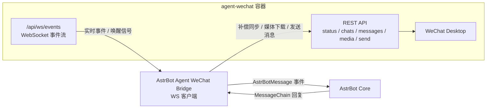

# AstrBot Agent WeChat Bridge

这是一个用于将 [AstrBot](https://github.com/AstrBotDevs/AstrBot) 接入个人微信的插件，底层依赖 [`agent-wechat`](https://github.com/thisnick/agent-wechat) 提供的 WebSocket 和 REST API。

本项目现在采用“`/api/ws/events` 事件流优先 + REST 补偿同步”的接入方式，参考了上游 `agent-wechat` 仓库中的 WebSocket 与消息同步实现思路：

- `WS /api/ws/events`：建立事件 WebSocket 连接
- `GET /api/status/auth`：检查微信登录状态
- `GET /api/chats`：做补偿同步，获取未读会话
- `POST /api/chats/{id}/open`：打开会话并清除未读
- `GET /api/messages/{id}`：拉取新消息
- `GET /api/messages/{id}/media/{localId}`：下载媒体附件
- `POST /api/messages/send`：发送回复（非文本消息）
- `GET /api/debug/a11y`：读取微信窗口无障碍树，供 X11 发送通道定位控件

## 架构图



说明：

- WebSocket 连接负责“优先触发”同步
- REST 负责鉴权检查、消息补偿、媒体下载和消息发送
- 这样即使上游事件流暂时没有完整广播所有消息，也不会影响插件可用性

## 功能说明

- 注册 AstrBot 平台适配器 `agent_wechat`
- 通过 WebSocket 客户端连接 `agent-wechat`
- 在 WS 事件或空闲超时后执行 REST 补偿同步
- 将微信私聊和群聊消息转换为 AstrBot 事件
- 将 AstrBot 的回复通过 `agent-wechat` 发回微信
- 支持文本、图片、文件、语音类消息发送
- 配置项极简：仅需服务地址与访问令牌

## 运行前提

1. 已部署并可访问的 `agent-wechat` 服务
2. 对应微信账号已通过 `agent-wechat` 登录
3. AstrBot 版本 `>= 4.16`

## 快速使用


### 先安装agent-wechat

```bash
npm install -g @agent-wechat/cli
wx up
```
- wx up运行后得到类似
```bash
[root@VM-0-10-opencloudos ~]# wx up
Container agent-wechat is already running.
API: http://localhost:6174
noVNC: http://localhost:6174/vnc/?token=cda8bb0945b636df2c5802edad83e2417f3cc9500e65cb4f3xxxxxxxxx&autoconnect=true
```
- cda8bb0945b636df2c5802edad83e2417f3cc9500e65cb4f3xxxxxxxxx,即为平台配置的token，后续配置要用到

### 在astrbot安装本项目的插件，安装后启用并重启

### 在侧边菜单中点击“机器人”，点右侧的“创建机器人”，在选择平台最下面会有个“agant_wechat”平台

### 填入上面获取到的token，启用即可

## 平台配置

AstrBot 加载插件后，在平台管理中添加 `agent_wechat`，配置项如下：

| 配置项 | 默认值 | 说明 |
| --- | --- | --- |
| `server_url` | `http://localhost:6174` | `agent-wechat` REST API 地址 |
| `token` | 空 | 如果服务开启鉴权，填写 Bearer Token |
| `enable_x11_send_fallback` | `true` | 是否启用容器内 X11 发送通道 |
| `x11_send_mode` | `always` | `always`：文本消息直接走 X11；`fallback`：先试接口，失败后再走 X11 |
| `x11_docker_container` | `agent-wechat` | 运行微信的容器名称 |
| `x11_display` | `:99` | 容器内的 X 显示编号 |
| `group_mention_free_senders` | 空 | 群聊免@成员 wxid 列表，名单里的人发言无需 @ 机器人 |

### 关于发送通道

上游 `agent-wechat` 的动作规划层在部分微信版本下会持续返回 `No action selected`，导致
`POST /api/messages/send` 完全不可用（上游 issue #169 / #170 / #171 / #173）。此时收消息一切正常，
但机器人回复发不出去。

为此本插件新增了绕过规划层的发送通道：直接用容器内的 `xdotool` + `xclip` 操作微信窗口
（点击会话 → 粘贴文本 → 点击发送按钮），并用无障碍树校验发送结果。

- 需要容器内存在 `xdotool`、`xclip`，且宿主机当前用户能执行 `docker exec`（必要时加入 `docker` 组）
- 默认 `x11_send_mode=always`，即文本消息不再尝试已知不可用的接口
- 图片/文件/语音等非文本消息仍然走接口
- 若上游修复了 `send` 接口，可把 `x11_send_mode` 改成 `fallback` 或关闭 `enable_x11_send_fallback`

插件内置固定策略（无需配置）：

- 收消息探测：`poll=200ms`，全量同步 `1200ms`
- 探测路径：`fast_probe_limit=1`、`fast_probe_fetch_limit=1`、`fast_probe_open_chat=false`
- 主动补偿：`active_probe_limit=2`、`active_probe_fetch_limit=2`、`active_probe_open_chat=false`
- 登录态检查：`30000ms`
- 热路径超时：`800ms`
- 媒体重试：`4` 次，每次间隔 `250ms`
- 消息转发策略：私聊/群聊均默认转发；触发回复的策略由 `group_mention_free_senders` 控制
- 群聊触发策略：默认**需要 @ 机器人**；`group_mention_free_senders` 名单里的成员可以不 @ 直接触发，其他人必须 @
- 群里既没 @ 机器人、又不在免@名单里的消息不会注入 `At(self_id)`，因此不会触发回复；
  但它仍会流经 AstrBot，群聊上下文照常可用
- 想让大模型真正「看到」群里没 @ 它的对话，需要在 AstrBot 里开启 `provider_ltm_settings.group_icl_enable`

也可以直接在 `cmd_config.json` 的 `platform` 数组里确保存在如下项：

```json
{
  "id": "agent_wechat",
  "type": "agent_wechat",
  "enable": true,
  "server_url": "http://localhost:6174",
  "token": "你的_agent_wechat_token"
}
```

## 常见排查

- 插件已安装但“完全没日志、没反应”：
  - 检查 AstrBot 的 `cmd_config.json` 是否真的有 `type=agent_wechat` 且 `enable=true`
  - 检查 `token` 是否正确。若 `curl http://localhost:6174/api/status/auth` 返回 `Unauthorized`，说明必须携带 token
- 日志里显示已收到消息但没有进入对话：
  - 检查 AstrBot 全局白名单。若开启 `enable_id_white_list=true`，需把会话 ID（如 `agent_wechat:FriendMessage:wxid_xxx`）加入 `id_whitelist`
- 消息进入 AstrBot 有明显延迟（如十几秒）：
  - 本插件已内置低延迟参数；若仍有明显延迟，优先检查 `agent-wechat` 侧 `open_chat` 调用是否耗时异常
- 发送后想看是否收到了：
  - 查看 AstrBot 日志中的 `[agent_wechat] inbound accepted ...`
- 日志里能收到消息、大模型也回复了，但微信里看不到消息：
  - 若之前出现 `No action selected`，说明命中了上游 `send` 接口缺陷；确认 `x11_send_mode=always`
  - 检查日志里是否出现 `[agent_wechat][send] X11 发送成功`
  - 检查微信是否掉回登录页：`curl -H "Authorization: Bearer $TOKEN" http://localhost:6174/api/status/auth`

## 实现细节

- 忽略以 `gh_` 开头的公众号/服务号会话
- 首次同步某个会话时，只处理未读尾部消息，不回灌整段历史
- 媒体下载采用与上游一致的方式：先 `open chat`，再按 `localId` 取媒体
- 针对媒体准备延迟，下载逻辑带有重试机制
- 当消息数据库写入晚于未读状态变化时，会用 `lastMsgLocalId` 做补偿轮询
- 当前上游的 `/api/ws/events` 路由已经存在，但实时消息广播仍未完全接通，所以插件保留 REST 补偿同步以保证稳定性
- 文本发送默认走容器内 X11 自动化，非文本消息仍走 `POST /api/messages/send`
- 由于 `agent-wechat` 没有原生的微信 `@` 发送接口，AstrBot 的 `At` 组件会降级为普通文本

## 更新日志

从当前版本开始，每次版本更新都会同步记录到 [CHANGELOG.md](./CHANGELOG.md)。

## 本地校验

```bash
python3 -m compileall src tests
pytest
```

如果当前环境没有安装 `pytest`，请先执行：

```bash
pip install -r requirements.txt
```
